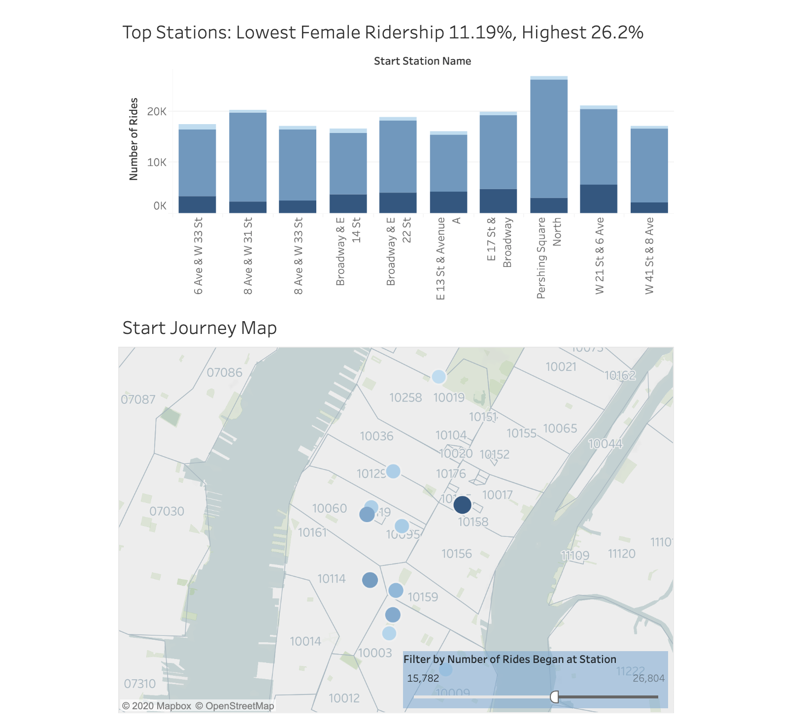
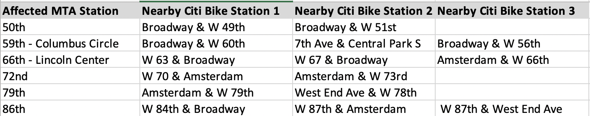

# Citi Bike Analytics Tableau Presentation

https://public.tableau.com/profile/nathaniel.al.najjar#!/vizhome/CitiBikeAnalytics_15880130792980/Gender

## Story 1: Gender Demographics & Ridership

As we are all aware, the Citi Bike program has seen substantial demographic disparities in ridership since its debut in 2013. Unfortunately, after spending some time with the data for the first three months of 2020, I can report that female riders are still substantially under-represented.

Between January 1, 2020 and March 31, 2020, there were almost 3.5 million rides taken in the Citi Bike System. As we all know, the onset of COVID-19 has severely impacted New York City and its transit ridership. Understandably, consumers are wary of sharing bicycles, seats, and handlebars with hundreds, if not thousands of other residents at this time. You will notice that both graphs show steep ridership drops in March 2020 – reflecting the spread of the virus, aggressive government countermeasures, and general wariness of outdoor activity. However, this presentation is not focused on the effect of COVID-19 on Citi Bike ridership.

Instead, I have been asked to prepare a report assessing how the well-known gender disparity in Citi Bike ridership has progressed into 2020. Female riders made 23.15% of all trips in the first three months of the year. 

Moving onto the second dashboard, I have broken down the full data into the 24 hours of the day, and we see the commuter peaks as expected. However, off peak hours, and particularly during nighttime hours, we notice that female riders make up an even lower percentage of ridership. This may imply that personal safety provides some explanation for the disparity. 

Working off this potential explanation, I decided to focus on the ten most popular stations in the system to start a journey, which are broken down in the third dashboard. Well-trafficked areas may provide a greater sense of personal safety and may see higher rates of female ridership compared to the system as a whole. Unsurprisingly, these stations are all located in Manhattan, roughly between Union Square and the major commuting hubs of Penn Station and Grand Central Terminal. However, these stations report no substantial variations in share of female ridership. 

There are many potential explanations for this unexpected phenomenon, such as variations in risk-taking behavior between males and females, the potential unsuitability of gender-specific clothing for bike riding, and of course, different calculations of personal safety, among others. My findings do not succinctly explain this significant disparity in ridership, but I hope they provide some insight for this important discussion.  

## Story 2: Jan 13th Flooding Event & Ridership

Over the past decade, the MTA has gained notoriety for delays, overcrowding, and breakdowns. Part of Citi Bike’s purpose is to provide New Yorkers with an alternative to the subway. 

On January 13th, 2020, a water main breakage flooded portions of the Upper West Side in Manhattan, causing major delays on the 1, 2, & 3 trains, which travel together on a shared set of tracks in this portion of the system. In total, 6 stations were closed between 5am and 4pm. I decided to study how this event influenced Citi Bike ridership rates, and gain perspective on whether New Yorkers will switch to Citi Bike when the subway is in distress. Here is a chart with the 6 closed MTA stations and their 2-3 nearest Citi Bike stations (totaling 15):

In the first dashboard, you will see two charts. The first is a summation of total rides started at the 15 stations on every Monday in January 2020,to compare equivalent commuting days (January 20th was a holiday, Martin Luther King Jr. Day, explaining the significant dip in ridership). The second chart gives a breakdown of rides by station, ranked in descending order by popularity on January 13th. 

As we can see, there was no significant boost in Citi Bike ridership on January 13th. Commuters may have ordered ride-share services, worked from home, or walked to work. However, since bike riding exposes you to the elements of a chilly January, commuters may give stronger consideration to our service at other points in the calendar year. 

In the second dashboard, you will see a map identifying the locations of the 15 Citi Bike stations overlaid on a map showing street names and MTA station details. The stations (marked by blue circles) are enlarged by size to show the amount of rides initiated on January 13th. Unsurprisingly, the stations that saw the largest ridership were between Times Square and Columbus Circle. 

An NBC News article on the flooding can be found here:
https://www.nbcnewyork.com/news/local/watermain-break-floods-upper-west-side-streets-disrupts-morning-commute/2258792/
